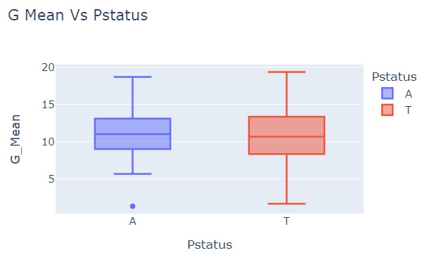
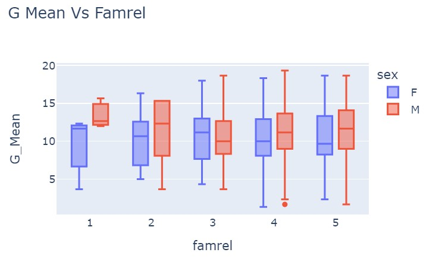
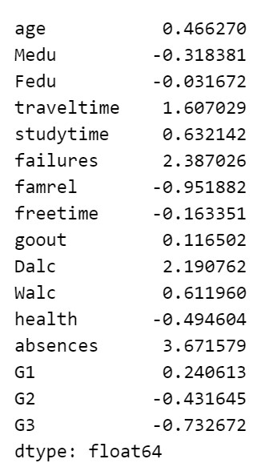
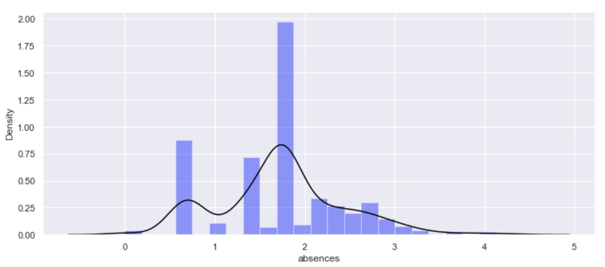

# Student-Performance-Analysis
This Repository is about Data Analysis of Students' Performance on Acadamics considering various parameters that affects their studies.
##### This Repo contain detailed analysis ansewring crucial question like, 
  - correlations between various features and grades
  - which features have a significant impact on grades
  - How family relation affects in student's grades
  - Affection of Parants' education on studies of student, etc.

Some of Questions and Results of it are as follows:
### Que-1: Calculate PPS(Predictive Power Score) for Feature Engineering 

### Que-2: Figure out how family relation(famrel) and parents cohabitation(Pstatus) affect grades of students.

### Que-3: Figure out which features in the data are skewed, and propose a way to remove skew from all such columns.

